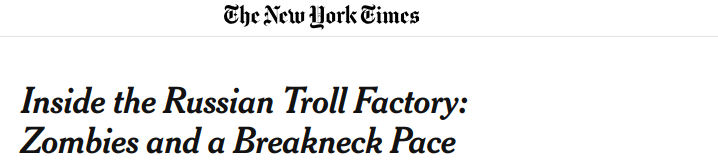
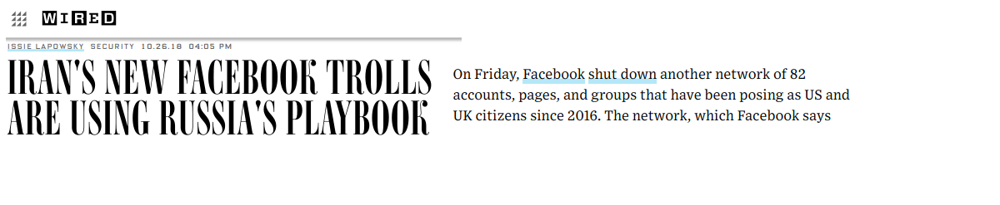
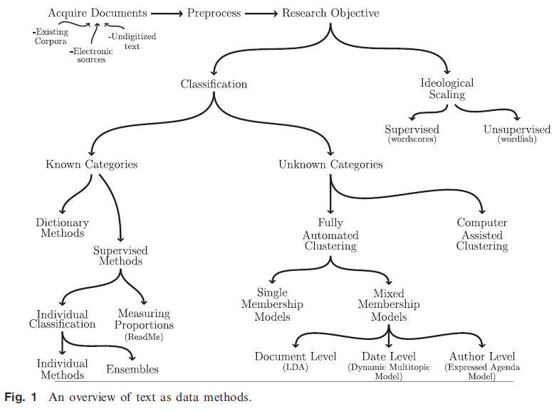
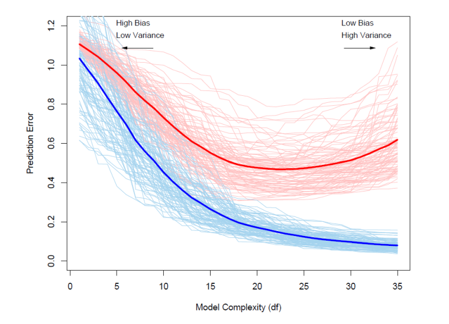
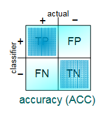
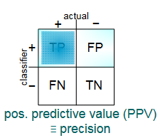
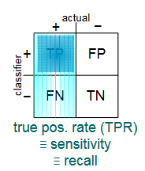
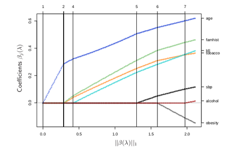
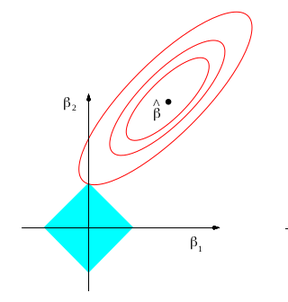
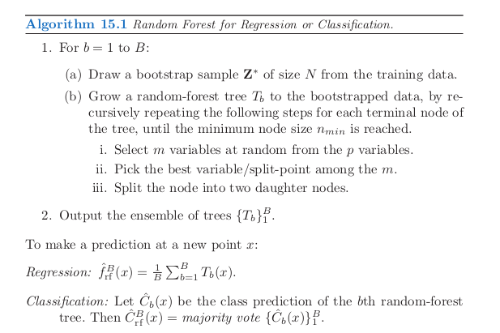

Introduction to Computational Text Analysis and Supervised Machine Learning in R
========================================================
author: Vlad Achimescu, University of Mannheim
date: 17/04/2019, Exeter Q-Step centre
font-family: 'Helvetica'
css: presstyle.css


Overview
========================================================
class: at85
1.Computational propaganda
  - methods of identification
  - list of Reddit trolls
  - explore Reddit dataset

<br>
2.Text as data 
  - Text processing
  - Document-term matrix
  - Example with Reddit submission titles
  
***
3.Basics of Machine Learning 
  - Lasso regression
  - Random forests
  - Identifying trolls on Reddit
  
4.Pipeline to apply to your own data or improve model on Reddit 
<br><br>
www.github.com/nomoteticus/mltext-tutorial-2009


Computational propaganda
========================================================
class: at75
<hr>
= "the use of algorithms, automation and human curation to purposefully manage and distribute misleading information over social media networks" (Wooley and Howard 2016)
- Pseudo-users: political bots, trolls, cyborgs
- (semi-)automation, scalability, anonimity
- Political astroturfing used for (Wooley & Guilebeaut 2017):
  - manufacturing or breaking consensus
  - bandwagon effect 
  - democratizing propaganda
  - attacking political adversaries
  - voter demobilization
- State-sponsored trolling


State-sponsored trolling
========================================================
<hr>
<br>
<br>
<br>

Labeling propaganda
========================================================
class: at70
<hr>
1. Hand coding by researchers
  - 
2. Use pre-existing labels:
  - official flags
      - s
  - informal flags
      - s
      - s
    
***

<br>
#### Example of informal flag:<br>
##### (Achimescu, Sultanescu, Sultanescu 2018)<br>


Official flags
========================================================
- Twitter
- Facebook
- Reddit


IMAGE HERE

Scraping data from Reddit
========================================================
- manual html scraping 
  - BeautifulSoup / rvest 
  - not reccomended
- using Reddit API
  - PRAW / RedditExtractoR
  - limited to 1000 items
- downloading from www.pushshift.io/reddit
  - submissions
  - comments
  
Let's see the data!
========================================================
class: at85
<hr>

```r
### For data manipulation
install.packages("dplyr","readr")
### For text processing
install.packages("quanteda")
### For machine learning
install.packages("caret","glmnet",
                 "randomForests","pdp")

library(dplyr)
library(readr)

### Piping operator %>%
rev(sort(round(log(rnorm(100, 5, 1),2))))
### Equivalent
rnorm(100, 5, 1) %>% 
  log(2) %>% round %>% sort %>% rev
```


Text as Data
========================================================
class: at75
<hr>
<p></p>
- Corpus = a collection of texts/documents
- Corpora often come with metadata
- Bag of words approach
  - Count of words for each document in corpus
  - Discards word order, ignores word meaning
  - Purpose: reduction of complexity
  
***
<br>
- Pre-processing steps:
  - tokenization
  - removing irrelevant features
  - stemming/lemmatization
  - creating a document-term matrix(DTM)
  - weighting the DTM


Computational text analysis
========================================================

<br><span clas="at75"><i>(Grimmer and Stewart 2013:2)</i></span>

Not covered in this seminar
========================================================
<hr><p></p>
- Part of Speech (POS) tagging<br>
- Named entity recognition (NER)<br>
- Word Sense Disambiguation (WordNet)<br>
- Word embeddings (word2vec)


Tokenization
========================================================
<hr>
Text: <span class = "sky">"X and Y are 2 Kremlin trolls! Trolling day and night for a few rubles."</span>
- Tokens
  - Sentences <span class = "sky">["X and Y are 2 Kremlin trolls !","Trolling day and night for a few rubles."]</span>
  - Words / Unigrams <span class = "sky">["X", "and", "Y", "are", "2", "Kremlin", "trolls", "!","Trolling", ..., "rubles","."]</span>
  - Letters
- N-grams
 - Bigrams <span class = "sky">[...,"Kremlin trolls","a few","few rubles",...]</span>
 - Trigrams <span class = "sky">[...,"day and night",...]</span>
 - Skip-grams <span class = "sky">["are Kremlin trolls",..."trolling for rubles",...]</span>


Text pre-processing
========================================================
class: small-code
<hr>

Text: <span class = "sky">"X and Y are 2 Kremlin trolls! Trolling day and night for a few rubles."</span>
- remove capitalization <br><span class="sky">Kremlin -> kremlin</span>
- remove stopwords <br><span class="sky">!["and","a","for","few","here"]</span>
- (remove non-words: numbers, punctuation) <span class="sky"><br>["2","!","."]</span>

Next steps:
- combine similar terms (stemming, lemmatization)
- create a Document-Term Matrix


Stemming vs Lemmatization
========================================================
<hr>
Many-to-one mapping from words to stem/lemma<br>

### Stemming 
- reducing inflected words to their word stem
- cutting off common suffixes 
<br><span class="sky">trolling -> troll<br>trolls -> troll<br>rubles -> rubl</span>

### Lemmatization
- based on morphological analysis of each word
<br><span class="sky">are -> be</span>


Let's tokenize and clean the texts!
========================================================

```r
install.packages("quanteda")
library(quanteda)

CRP = corpus(data_frame, 
             docid_field, 
             textid_field)
# Alternative:
CRP = corpus(vector_of_documents)

TOK = tokens(CRP)
```

Document-Term Matrix (DTM)
========================================================
<hr><span class = "at75">
- Each document = a vector of word counts<br>
- N (number of documents) rows X P (number of features) columns
- Discards word order, ignores word meaning
- Large and sparse matrix (many 0s)
- Main Input for Supervised Machine Learning 

<span class = "sky">
Text1: "X and Y are 2 Kremlin trolls! Trolling day and night for a few rubles."<br>
Text2: "Kremlin's trolls are here tonight"<br>
Text3: "Days are few and long"</span>
<table class="tg">
  <tr>
    <th></th>
    <th>x</th>
    <th>and</th>
    <th>y</th>
    <th class ='tg-emp'>are</th>
    <th class ='tg-emp'>kremlin</th>
    <th class ='tg-emp'>troll</th>
    <th>day</th>
    <th>night</th>
    <th>for</th>
    <th>a</th>
    <th>few</th>
    <th>rubl</th>
    <th>here</th>
    <th>tonight</th>
    <th>long</th>
  </tr>
  <tr>
    <td>text1</td>
    <td>1</td>
    <td>2</td>
    <td>1</td>
    <td class ='tg-emp'>1</td>
    <td class ='tg-emp'>1</td>
    <td class ='tg-emp'>1</td>
    <td>2</td>
    <td>1</td>
    <td>1</td>
    <td>1</td>
    <td>1</td>
    <td>1</td>
    <td>0</td>
    <td>0</td>
    <td>0</td>
  </tr>
  <tr>
    <td>text2</td>
    <td>0</td>
    <td>0</td>
    <td>0</td>
    <td class ='tg-emp'>1</td>
    <td class ='tg-emp'>1</td>
    <td class ='tg-emp'>1</td>
    <td>0</td>
    <td>0</td>
    <td>0</td>
    <td>0</td>
    <td>0</td>
    <td>0</td>
    <td>1</td>
    <td>1</td>
    <td>0</td>
  </tr>
    <tr>
    <td>text3</td>
    <td>0</td>
    <td>1</td>
    <td>0</td>
    <td>1</td>
    <td>0</td>
    <td>0</td>
    <td>1</td>
    <td>0</td>
    <td>0</td>
    <td>0</td>
    <td>0</td>
    <td>0</td>
    <td>0</td>
    <td>0</td>
    <td>1</td>
  </tr>
</table>


Normalization and Weighting
========================================================
left: 50%
class: at75
<hr>
### Normalization (relative frequencies)
- proportions of the feature counts within each document
$$\mu_{j}  = \frac{\sum_{i=1}^{P}tf_{ij}}{N_{j}}$$

### TF-IDF weighting
- Term Frequency - Inverse Document Frequency
$$w_{i,j} = tf_{i,j}\cdot log(\frac{N}{df_{i}})$$

<table class="tg2">
  <tr>
    <th></th>
    <th>x</th>
    <th>y</th>
    <th>kremlin</th>
    <th>troll</th>
    <th>day</th>
    <th>night</th>
    <th>rubl</th>
    <th>tonight</th>
    <th>long</th>
  </tr>
  <tr>
    <th>text1 - normalized</th>
    <th>0.125</th>
    <th>0.125</th>
    <th>0.125</th>
    <th>0.250</th>
    <th>0.125</th>
    <th>0.125</th>
    <th>0.125</th>
    <th>0</th>
    <th>0</th>
  </tr>
  <tr>
    <th>text1 - TF-IDF</th>
    <th>0.477</th>
    <th>0.477</th>
    <th>0.176</th>
    <th>0.352</th>
    <th>0.176</th>
    <th>0.477</th>
    <th>0.477</th>
    <th>0</th>
    <th>0</th>
  </tr>
  <tr>
    <th>text1 - TF-IDF normalized</th>
    <th>0.059</th>
    <th>0.059</th>
    <th>0.022</th>
    <th>0.044</th>
    <th>0.022</th>
    <th>0.059</th>
    <th>0.059</th>
    <th>0</th>
    <th>0</th>
  </tr>
</table>


Let's build the DFM!
========================================================

```r
library(quanteda)

CRP = corpus(data_frame)
TOK = tokens(CRP)
DFM = dfm(TOK)
```


Machine learning
========================================================
class: at70 
<hr>
<i>James, Witten, Hastie and Tibshirani, 2017. An introduction to statistical learning. New York: Springer</i>
#### Goal: building a statistical model for predicting or estimating an output based on one or more inputs
  - <b>X</b> = Inputs / Features
    - ~ Independent variables
  - <b>y</b> = Output / Response
    - ~ Dependent variable<br>
    
<table>
  <tr>
    <th></th>
    <th colspan="3">Inputs (<b>X</b>)</th>
    <th>Output (<b>y</b>)</th>
    <th></th>
  </tr>
  <tr>
    <td>x1</td>
    <td>1</td>
    <td>0</td>
    <td>2</td>
    <td>TROLL<br></td>
    <td>y1</td>
  </tr>
  <tr>
    <td>x2</td>
    <td>0</td>
    <td>0</td>
    <td>5</td>
    <td>not troll</td>
    <td>y2</td>
  </tr>
  <tr>
    <td>x3</td>
    <td>0</td>
    <td>1</td>
    <td>-2</td>
    <td>not troll</td>
    <td>y3</td>
  </tr>
</table>

***
<br>
### Supervised ML
- learn mapping from inputs to outputs given a labeled set of input-output pairs
- use mapping on new (unlabeled) inputs
- task depends on measurement level of Y
  - Y is categorical: classification (2+ classes)
  - Y is continuous: regression

### <br>Unupervised ML
- find patterns in data given only inputs <br>(no Y)
- e.g. clustering

Supervised machine learning for document classification
========================================================
<hr>
- documents are automatically coded according to previously defined content categories by training a computer to replicate the coding decisions of humans
- hand coding is used to train, or supervise, statistical models to classify texts in pre-determined categories.
- goal is to classify unknown documents by using the hand-coding to “train” or “supervise” statistical models to classify the remaining documents
- can use the document-term matrix as input, along with available metadata


Training and test set
========================================================
class: at75
<hr>
- Split the set of observations into <b> a training set</b> and <b> a test set</b>
- Learn the relationship between input and output using <b>only</b> training data
- Check the prediction error on test data, see if overfitting:



Let us prepare the data
========================================================

```r
install.packages("caret","glmnet","randomForests")
library(caret)
```


Cross-validation
========================================================
class: at75
- randomly divide the set of observations into <i>k</i> groups (5,10) of equal size
- used for model selection
  - for k = 1..K, train on all folds but kth, validate on kth
  - average of k estimates of test error
<span class = "at150">
$$CV_{k}=\frac{1}{k}\sum_{i=1}^{k}{Err_{i}}$$ $$Err_{i}=I(y_{i} \neq \hat{y}_{i})$$
</span>
<table class = "tg3">
  <tr>
    <th></th>
    <th>1</th>
    <th>2</th>
    <th>3</th>
    <th>4</th>
    <th>5</th>
  </tr>
  <tr>
    <td>k=1</td>
    <td><b><b>VALIDATE</b></td>
    <td>train</td>
    <td>train</td>
    <td>train</td>
    <td>train</td>
  </tr>
  <tr>
    <td>k=2</td>
    <td>train</td>
    <td><b>VALIDATE</b></td>
    <td>train</td>
    <td>train</td>
    <td>train</td>
  </tr>
  <tr>
    <td>k=3</td>
    <td>train</td>
    <td>train</td>
    <td><b>VALIDATE</b></td>
    <td>train</td>
    <td>train</td>
  </tr>
  <tr>
    <td>k=4</td>
    <td>train</td>
    <td>train</td>
    <td>train</td>
    <td><b>VALIDATE</b></td>
    <td>train</td>
  </tr>
  <tr>
    <td>k=5</td>
    <td>train</td>
    <td>train</td>
    <td>train</td>
    <td>train</td>
    <td><b>VALIDATE</b></td>
  </tr>
</table>
- can also do repeated cross-validation

Model selection
========================================================
class: at75
<hr>

Many different methods/classifiers:
- Logistic regression
- Regularized logistic regression
  - Ridge Regression
  - <b> The Lasso </b>
  - Elastic net
- K nearest neighbours
- Naive Bayes
- Support vector machines
- Neural networks
  
*** 
<br><br>
- Generalized additive models (GAMs)
- Tree-based methods
  - Classification trees (CART)
  - Bagging
  - Boosting
  - <b> Random forests </b>

*** 
There is no single best model that works optimally for all datasets


Model evaluation / Metrics 
========================================================
<hr>
need to finish
 
 
 

Supervised ML - summary
========================================================
<hr>
<br><br><br><br><br><br><br><br>

```r
library(caret)
library(glmnet)
library(randomForest)
```


The Lasso
========================================================
class: at75
<hr>
Problem: large number of features K>>N<br>
Solution: Logistic regression with L1 norm/penalty 
- shrinks some coefficients to 0

Advantages of LASSO
- built-in feature selection: reduces the number of variables
- control for multicollinearity 
- fast convergence

Disadvantages:
- linearity assumption for continuous predictors
- additive assumptions: interactions between predictors have to be specified

Lasso regression
========================================================
class: at75
<hr>
Maximizes the penalized log-likelihood:<br>

$$ a+b $$

Lambda is the tuning parameter
- lambda=0: no penalization
- max(lambda): all coefficients = 0

 
 


Let's throw the Lasso!
========================================================

```r
library(caret)
library(glmnet)
```


Decision trees
========================================================
class: at70
<hr>
#### <b>CART</b> = Classification and Regression Trees
- non-parametric
- partition of the feature space
- good for capturing interaction effects
- can overfit training data
!!! ADD GRAPH !!!


Random forests
========================================================
class: at70
<hr>
- Advantage: nonparametric, captures complex relationships and nonlinearity
- Disadvantage: computationally intensive, noise increases misclassification
- Algorithm: grow B trees and average prediction across all of them

<br>(Hastie, Tibshirani and  2018)

Let's grow a forest!
========================================================
<hr>

```r
library(caret)
library(glmnet)
```


Other uses with comments/tweets
========================================================
<br>
- Tory vs Labour
- Remain vs Leave EU
- Democrat vs Republican
- Your data 
    - any ideas?

References
========================================================
<hr>
coming soon

